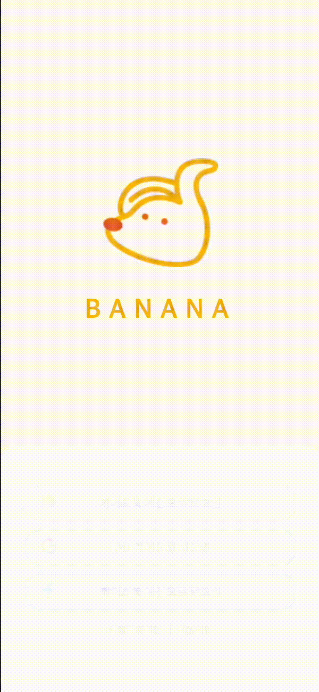
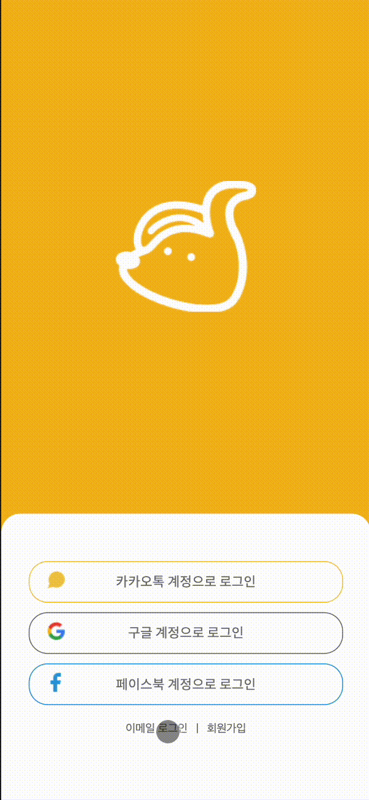

## [Banana Demo](https://scato3.github.io/BANANAMARKET/)

## [바나나 피그마](https://www.figma.com/file/R69gRlt5uLIhwZvkyPZWHy/%EB%B0%94%EB%82%98%EB%82%98%EB%A7%88%EC%BC%93?node-id=0%3A1)

# 🍌바나나마켓

바나나마켓 서비스는 자신의 스토어에서 판매하고 있는 상품을 등록하여 홍보할 수 있는 SNS입니다. <br>다양한 상품을 업로드할 수 있습니다.

상품을 등록하지 않아도 일상을 공유하며 즐거운 SNS 활동을 할 수 있습니다. <br>글과 사진과 함께 게시물을 작성하여 자신의 일상을 공유할 수 있습니다. <br>다른 사용자를 팔로우하면 유저가 올린 게시물을 홈 피드에서 소식을 확인할 수도 있습니다. <br>또한 다른 사용자와 메시지를 주고 받을 수 있습니다.

피드를 구경하다가 마음에 드는 게시물을 발견했다면 좋아요를 누를 수 있고 댓글을 남기거나 공유를 할 수도 있습니다.<br>
SNS를 통한 온라인 소통의 장 바나나마켓입니다.


## 1. 구현 목표

-   바나나마켓 SNS 개발

## 2. 개발 일정

-   HTML, CSS : 2022. 01. 08.
-   Vanilla JavaScript : 2022. 01. 13 ~ 2022. 01. 25.

## 3. 프로젝트 구조

```
.
├── css
│    ├── components
│    │      └── navbar.css
│    └────── ...css
│
├── img
│    ├── 2
│    └── ...img
├── js
│    └───── ...js
│
└── ...html
```

## 4. 역할

-   게시글 작성(user_post) 페이지 마크업 및 UI, 기능 구현
    -   유저 프로필 사진 불러오기 (api 요청)
    -   이미지 서버에 올리기 전 미리보기 기능 (
    -   이미지 서버에 올리기
-   포스팅 페이지 마크업 및 UI 구현

## 5. UI


<br/>

## 6. 기능

|                                           1. Splash                                            |                                         2. 회원가입                                         |
| :--------------------------------------------------------------------------------------------: | :-----------------------------------------------------------------------------------------: |
|          |         |
|                                           3. 로그인                                            |                                         4. 피드화면                                         |
|           |         |
|                                    5. 포스팅 좋아요 및 댓글                                    |                                6. 게시글 작성 및 나의 페이지                                |
|   |       |
|                                      7. 다른 사람 페이지                                       |                                       8. 프로필 수정                                        |
|       |  |
|                                     9. 게시글 수정 및 삭제                                     |                                        10. 상품 등록                                        |
|        |   |
|                                     11. 상품 수정 및 삭제                                      |                                   12. 팔로우 및 언팔로우                                    |
|  |     |
|                                          13. 로그아웃                                          |
|        |

## 7. 고민했던 부분과 해결한 부분 및 느낀점

-   협업 프로젝트가 처음이다보니 깃허브 사용부터 어려웠는데 이번 기회에 Git 기본 명령어들을 많이 접해봐서 다음 협업 때는 더 잘 다룰 수 있을 것 같다. 1일1커밋의 뿌듯함도 얻어가는 경험이었다.

-   구조화된 마크업을 작성하고 싶어서 헤딩 태그, 이미지 대체 문구 등을 빠지지 않고 작성하려고 하였고 W3C Markup Validation Service 를 통해 검토하였다.

-   게시물 작성 페이지에서 이미지 미리보기를 구현할 때 기존에 없던 요소의 마크업을 추가하는 것이 새로웠고 이미지 추가할 때 자바스크립트로 이미지 태그 요소를 추가하여 자식 요소로 추가하는 것을 알게 됐다.
